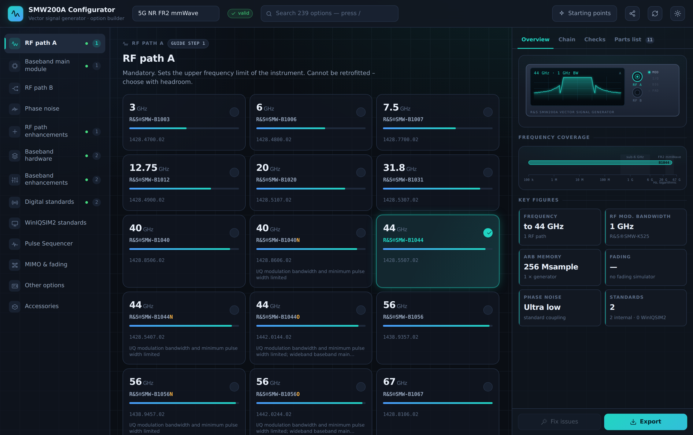

# R&S®SMW200A Configurator

An interactive configurator for the Rohde & Schwarz SMW200A vector signal
generator. Pick options, watch the instrument take shape, and get a parts list
that has been checked against every rule in the configuration guide.

It is a static site — plain HTML, CSS and ES modules, no build step, no runtime
dependencies. Open `index.html` and it runs.



## What it does

**Checks the rules, rather than just collecting clicks.** All 239 options carry
their prerequisites, conflicts and quantity limits from the configuration guide.
Selecting R&S®SMW-K512 without R&S®SMW-K511 is not silently accepted — the
Checks panel names what is missing and offers to add it. *Fix issues* follows
prerequisite chains to a valid configuration, and refuses dead ends instead of
inventing an instrument that cannot be ordered.

Rules covered include the RF path A/B combination matrix, the deeper-chassis
requirement, the "O" frequency variants that force the wideband main module,
phase noise levels that must match across paths, the standard/wideband baseband
split, floating licences, per-RF-path option sets, and quantity steps such as
the fading simulator's 1 / 2 / 4.

**Shows the instrument, not a list of checkboxes.** Two views of it, switched
with *Photo* / *Schematic*, either face, either one enlarged.

The photograph is of one particular instrument — two RF paths to 44 GHz, every
connector fitted — so on its own it would misrepresent most configurations.
What makes it a configurator rather than decoration is the overlay: each
connector the configuration decides carries a ring saying whether it is fitted,
absent, or moved to the other face, the rear bays fill as baseband modules are
added, and it says so plainly when a configuration needs more modules than the
photographed instrument carries.

**The frequency scale shows what your choice changed.** Every frequency option
covers 100 kHz upward and they differ only in the upper limit, so a scale
starting at 100 kHz spends most of its width on a range identical for every
configuration. This one runs 1 GHz to 67 GHz, where 3 GHz sits at 26% of the
width instead of 77% and the closest pair of options is 2.3% apart instead of
0.7%. The shared coverage below 1 GHz is compressed behind an axis break rather
than dropped, and each bar runs through it. Bands are named across the whole
range: the IEEE radar letters L, S, C, X, Ku, K, Ka and V, with 5G FR1 and FR2
beneath.

The schematic is the view that matches *any* configuration exactly. The
connectors drawn are the ones the specifications say that configuration arrives
with:

- the RF output connector type comes from the frequency option, so
  R&S®SMW-B1003 fits an N female and R&S®SMW-B1067 a 1.85 mm female
- R&S®SMW-B81 to ‑B84 move the RF outputs from the front panel to the rear,
  and B81/B83 take the path A I/Q inputs with them, so connectors leave one
  face and appear on the other
- every baseband generator and fading simulator adds its own block of rear
  panel connectors, and a wideband generator brings QSFP+ high-speed digital
  I/Q where a standard one brings 26-pin MDR
- the analog and digital I/Q output groups appear only once an option
  activates them

Positions on the panel are schematic — the specifications give the inventory and
the connector types, not a panel layout, and the drawing says so.

The display in the front view is live: carrier count follows the number of
baseband generators, occupied bandwidth follows the installed extensions, AWGN
lifts the noise floor, fading adds ripple, and R&S®SMW-K811 carves notches. The
signal chain diagram animates from baseband through fading and routing to the RF
connectors, and the frequency ruler places both paths on a log axis against
sub-6 GHz and FR2.

**Gets you started and gets out of the way.** Eight validated starting points
cover common tasks — 5G NR FR1 and FR2, MIMO fading, GNSS, radar and EW, Wi-Fi,
satellite. Search spans every option by code, name or order number. The full
configuration lives in the URL, so a link is a complete handover.

Export gives CSV, JSON (parts list plus derived capabilities and any open
issues) or a printable page.

## Running it

Any static file server works; ES modules need HTTP rather than `file://`.

```sh
python3 -m http.server 8000     # then open http://localhost:8000
```

Tests:

```sh
node --test                       # rules, panel, scale and overlay
npm install                       # only needed for the browser suites
node tests/browser/run.mjs        # 11 suites, 81 checks, in a real browser
node tests/browser/run.mjs xss    # or just one
```

`node --test` needs nothing installed. The browser suites need Playwright and a
Chromium build; they start their own static server on port 8899 and drive the
page for things a unit test cannot see — labels overlapping in a drawing, a
sandboxed frame still being able to clear a configuration, the standalone build
running from `file://` with no network at all. Set `SMW_BROWSER` if Chromium is
somewhere Playwright will not find on its own.

### One file, no server

```sh
node tools/build-standalone.mjs        # -> dist/smw200a-configurator.html
```

Inlines the stylesheet, every module and both photographs into a single
~400 kB HTML file that
runs by double-clicking it — no server, no network. Useful for handing the
configurator to someone who just wants to open it. The builder has no
dependencies: the modules form a plain chain with no cycles and no clashing
top-level names, so concatenating them in order is all it takes. It refuses to
emit a page whose stylesheet did not survive, and checks that every module a
module imports is listed ahead of it, because both failures otherwise produce a
file that looks valid and breaks at runtime.

The file is a build product and is not checked in; rebuild it after changing
anything under `assets/`.

## Where the data comes from

Everything is transcribed from Rohde & Schwarz product documentation, kept in
`docs/source/` so any entry can be traced back:

| Document | Used for |
| --- | --- |
| `SMW200A_configguide_en_3606803792_v0600.pdf` | option list, order numbers, all configuration rules, step numbering |
| `SMW200A_specs_en_3606803722_v3100.pdf` | derived figures; the front and rear panel connector tables; five options newer than the guide |
| `SMW200AMIMOFading_specs_en_3673127622_v0400.pdf` | fading channel counts and MIMO orders |
| `DigitalStandards_specs_en_5213943422_v2800.pdf` | digital standards background |
| `GNSSAvionicsSimulationRSSignalGenerators_specs_en_3607689622_v1700.pdf` | GNSS channel behaviour |
| `PulseSequencerSoftware_specs_en_3607138822_v1300.pdf` | Pulse Sequencer option chain |
| `WinIQSIM2_specs_en_5213746022_v2200.pdf` | WinIQSIM2 standards |
| `SMWZKK_ZKV_datsw_en_3683823822_v0200.pdf` | combiner kits for R&S®SMW-K555 |
| `WIC5GMobiledevicetestingmisc3609763192.pdf` | 5G device test context |
| `docs/photos/*.jpg` | Rohde & Schwarz product photographs; `assets/img/` holds the resized copies the page uses |

The configuration guide is version 06.00 (May 2024). Five options appear only in
the specifications document (version 31.00) — R&S®SMW-K508, ‑K554, ‑K556, ‑K573
and ‑K575. They are included and marked *newer than guide v06.00* in the
interface.

## How it is put together

```
index.html              shell and layout
assets/css/app.css      design system, both themes
assets/js/
  util.js               shared helpers
  catalog.js            239 options: order numbers, rules, quantity limits
  rules.js              expression parser, validator, autoResolve
  derive.js             selection -> instrument capabilities
  diagram.js            display, signal chain, frequency scale (SVG)
  panel.js              front and rear panel elevations (SVG)
  photos.js             where the photographs live; rewritten by the build
  photo.js              the photographs, with the configuration marked on them
  ui.js                 icon set and stateless render helpers
  presets.js            validated starting points
  app.js                state, rendering, events, export
tests/rules.test.mjs    rule regression tests
tests/panel.test.mjs    panel, scale and photo overlay tests
tests/browser/          browser suites and their runner
tools/build-standalone.mjs  single-file build
```

Requirements are written in a small expression language that mirrors the
guide's *Requires* column:

```js
requires: '((B13|B13T)&K16)|(B13XT&K17)'   // R&S®SMW-K540, envelope tracking
maxReq:   'B10*2'                          // a second unit needs two R&S®SMW-B10
```

`A&B` is both, `A|B` is either, `A*2` needs two units, and named shorthands
stand in for groups the guide keeps referring to — `GEN` is any baseband
generator, `WGEN` the wideband ones, `BB` any main module, `GNSS` any navigation
standard. An atom counts every option in its group, so `GEN*2` is satisfied by
one R&S®SMW-B9 plus one ‑B10 exactly as the guide intends.

### Adding or changing an option

Add a record to `OPTIONS` in `catalog.js`. The interface, validation, search,
parts list and export all follow from the data — no other file needs touching
unless the option introduces a rule the expression language cannot state, in
which case `validate()` in `rules.js` is where special cases live.

`node --test` will tell you if an expression references an unknown option, if a
conflict is declared on only one side, or if a starting point stopped being
valid.

## Publishing

`.github/workflows/pages.yml` publishes the site to GitHub Pages on pushes to
the default branch. It needs Pages enabled for the repository with **Source:
GitHub Actions** (Settings → Pages). Nothing else is required — the site is
served exactly as it sits in the repository.

## Hosting notes

The app degrades rather than breaking where a host is restrictive. Browser
storage is treated as a convenience — private windows and sandboxed frames make
those calls throw, and the configurator carries on without them, since the full
configuration also lives in the URL. Some hosts sandbox the frame and never let
a page start a download; where such a host exposes a save API the export buttons
use it, and where saving is refused outright the dialog says so instead of
offering a button that does nothing. On an ordinary web server neither path
applies and downloads work normally.

## Scope

This is a planning aid built from public documentation, not an ordering system.
It carries no prices and no availability, and R&S documentation states that data
without tolerance limits is not binding. Confirm any configuration with Rohde &
Schwarz before ordering.

R&S® is a registered trademark of Rohde & Schwarz. Bluetooth®, CDMA2000®, LoRa®
and other marks belong to their respective owners. This project is not
affiliated with or endorsed by Rohde & Schwarz.
